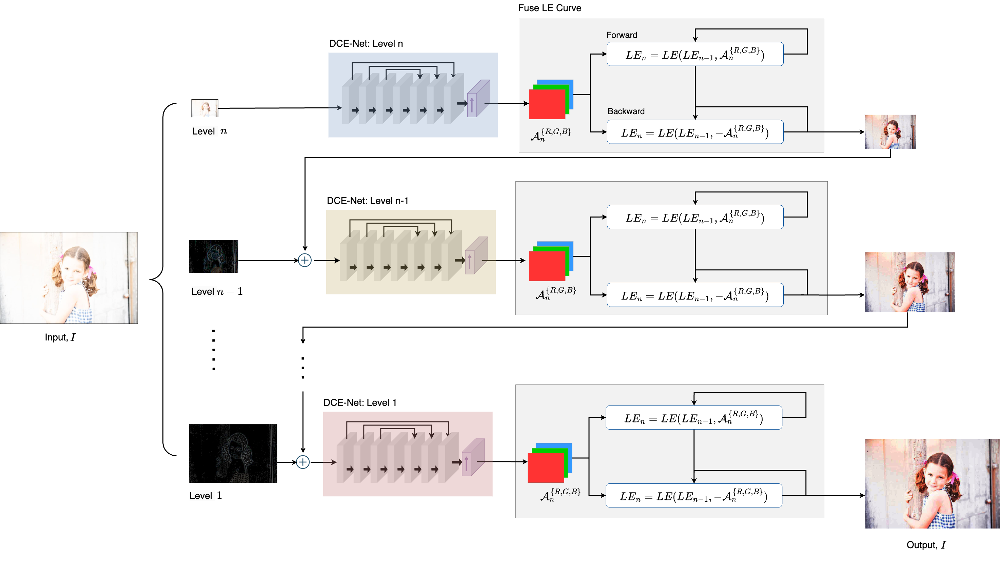

<h1 align="center">Exposure Correction</h1>
<div align="center">
  <h4>Restore over-exposure images based on Zero-DCE</h4>
</div>
<p align="center">
  <a href="#project-info">Project Info</a>&nbsp;&nbsp;•&nbsp;
  <a href="#key-features">Key Features</a>&nbsp;&nbsp;•&nbsp;
  <a href="#technical-architecture">Technical Architecture</a>&nbsp;&nbsp;•&nbsp;
  <a href="#prerequisites">Prerequisites</a>&nbsp;&nbsp;•&nbsp;
  <a href="#installation">Installation</a>&nbsp;&nbsp;•&nbsp;
  <a href="#usage">Usage</a>
</p>

> [!NOTE]
> 
> Exposure Correction  is used to adjust the brightness of photos or images to achieve an ideal exposure level, correcting detail loss caused by overexposure (too bright) or underexposure (too dark), thereby enhancing image quality and visual effects.  
> Our work combines the methods from three papers, modifying the network framework to achieve effective exposure correction.

## Related Papers
- [Zero DCE, CVPR 2020](https://github.com/Li-Chongyi/Zero-DCE)
- [Learning Multi-Scale Photo Exposure Correction, CVPR 2021](https://github.com/mahmoudnafifi/Exposure_Correction)
- [Reversed and Fused Zero-DCE](https://ieeexplore.ieee.org/document/10604009)

## Project Info

> [!Tip]
> - Based on the paper "Zero-Reference Deep Curve Estimation for Low-Light Image Enhancement"
> - Implements both original and GAN-based approaches
> - Supports batch processing and real-time enhancement

## Contributors
 

## Key Features
- **Zero-Reference Learning**: No paired training data required
- **Real-Time Processing**: Efficient enhancement pipeline
- **Multiple Approaches**: 
  - Original Zero-DCE implementation
  - GAN-based enhancement
  - Backward compatible version
- **Batch Processing**: Support for processing multiple images
- **Comparison Tools**: Built-in tools for comparing different enhancement results

## Technical Architecture
<div align="center">
  
</div> 

- **Framework**: PyTorch
- **Key Components**:
  - Deep Curve Estimation Network
  - Non-reference Loss Functions
  - Optional GAN Architecture
- **Support for**:
  - CPU and CUDA processing
  - Multiple GPU training
  - Batch processing

## Environment
> [!CAUTION]
> We are using the following environment to develop this project.
> - NVIDIA GeForce RTX 4090
> - Ubuntu 24.04 LTS
> - python = 3.7
> - pytorch = 1.13.1
> - torchvision = 0.14.1
> - torchaudio = 0.13.1
> - Cuda = 11.7
> - OpenCV

## Installation

1. **Clone the repository:**
   ```bash
   git clone https://github.com/ChuEating1005/Exposure-Correction
   cd Zero-DCE
   ```

2. **Install dependencies:**
   ```bash
   pip install -r requirements.txt
   ```

## Usage

### Training
```bash
python train/lowlight_train.py
```

### Testing
```bash
python test/lowlight_test.py --test_dir ./data/test_data
```

### Comparison
```bash
python compare.py
```

## Project Structure
```
Zero-DCE/
├── data/               # Dataset directory
├── models/            # Model architectures
├── train/             # Training scripts
├── test/              # Testing scripts
├── utils/             # Utility functions
└── snapshots/         # Model checkpoints
```

## License
This project is licensed under the MIT License - see the [LICENSE](LICENSE) file for details.